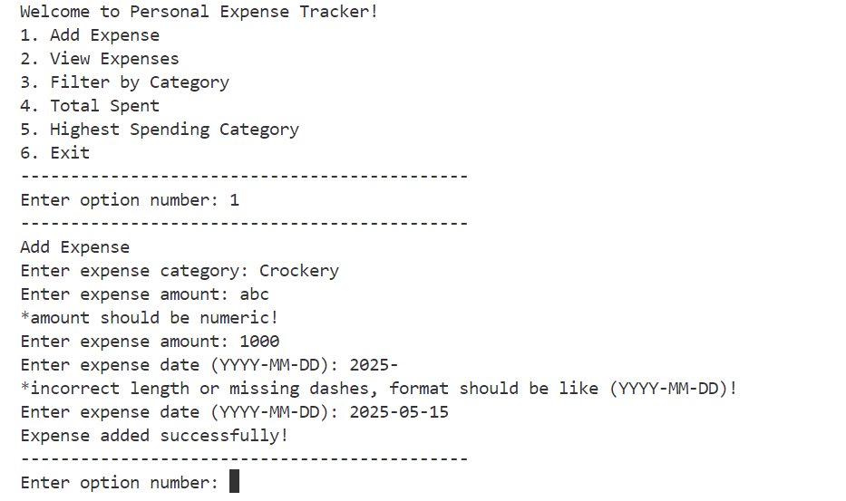
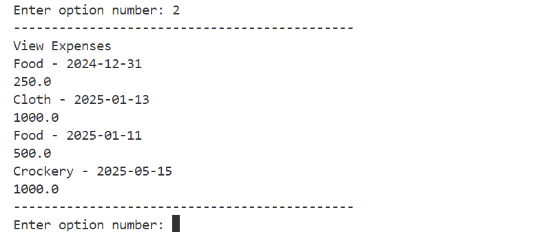
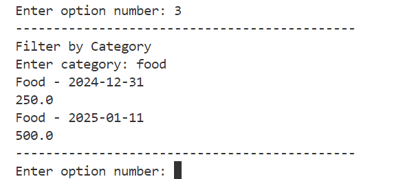
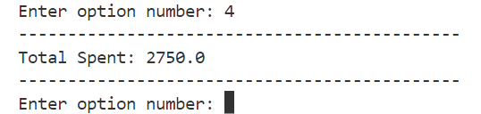
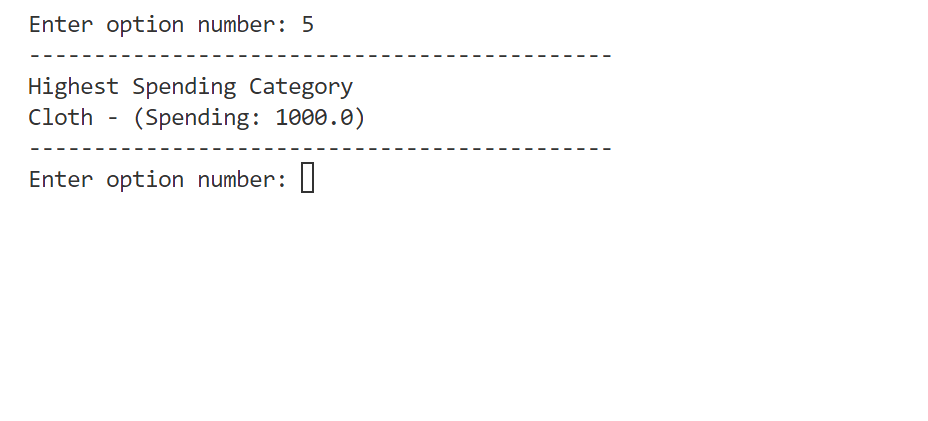
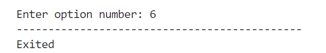

# 🧮 Personal Expense Tracker | Python Command-Line Project

A practical command-line **Expense Tracker** developed using Core Python. This project helps strengthen Python fundamentals, data structures, loops, and input handling skills.

---


---

## 📋 Table of Contents
- [🧮 Personal Expense Tracker | Python Command-Line Project](#-personal-expense-tracker--python-command-line-project)
  - [](#)
  - [📋 Table of Contents](#-table-of-contents)
  - [📚 Project Overview](#-project-overview)
  - [🚀 Features](#-features)
  - [🧠 Concepts Covered](#-concepts-covered)
  - [⚙️ Installation](#️-installation)
  - [🎮 How to Use](#-how-to-use)
  - [📸 Screenshots](#-screenshots)
  - [🚧 Future Enhancements](#-future-enhancements)
  - [✨ Author](#-author)
  - [📄 License](#-license)

---

## 📚 Project Overview

This project is a **Personal Expense Tracker** where users can record, view, and analyze their expenses through a command-line interface using **pure Core Python**.

Key Objectives:
- Strengthen Core Python concepts
- Practice data management and organization
- Build practical financial tracking skills
- Implement user-friendly command-line interfaces

---

## 🚀 Features

✅ Add expenses with category, amount, and date
✅ View all recorded expenses in a readable format
✅ Filter expenses by category
✅ Calculate total spent across all categories
✅ User-friendly menu navigation
✅ Save data to file (.csv)
✅ Load existing data from file
✅ Validate user input (check for valid float, non-empty strings)
✅ Track highest spending category

---

## 🧠 Concepts Covered

- Variables, Input/Output
- Strings, String Methods
- Lists, Dictionaries
- Conditional Statements (if, elif, else)
- Loops (for)
- Logical & Membership Operators (and, in)
- Functions
- Typecasting, len()
- String Methods: lower()
- File Handling

---

## ⚙️ Installation

```bash
# Clone the repository
git clone https://github.com/aayantasneem/expense-tracker.git

# Navigate to the project directory
cd expense-tracker-python

# Run the application
python expense_tracker.py
```

---

## 🎮 How to Use

1. Open terminal/command prompt
2. Run the Python script `expense_tracker.py`
3. Select from the menu options:
   - **Add Expense**: Enter category, amount, and date
   - **View Expenses**: See all recorded expenses
   - **Filter by Category**: View expenses from a specific category
   - **Total Spent**: Calculate overall expenditure
   - **Highest Spending Category**: View category, where spending highest
   - **Exit**: Close the application
4. Follow on-screen prompts to navigate the application

---

## 📸 Screenshots

> 
> 
> 
> 
> 
> 

---

## 🚧 Future Enhancements

- Monthly expense summaries and reporting
- Data visualization with ASCII charts
- Budget setting and alerts
- Export data to CSV or Excel formats
- Recurring expense tracking
- Multiple currency support
- Expense categorization insights

---

## ✨ Author

Developed with ❤️ by [M. Aayan Tasneem](https://github.com/aayantasneem)
> **LinkedIn**: [https://www.linkedin.com/in/muhammadaayantasneem](https://www.linkedin.com/in/muhammadaayantasneem)

---

## 📄 License

This project is licensed under the **MIT License**. See the [LICENSE](LICENSE) file for details.